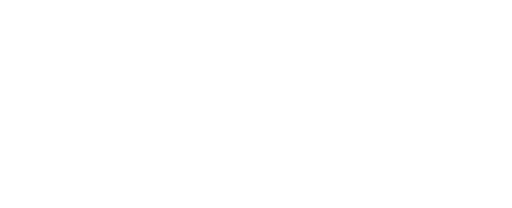
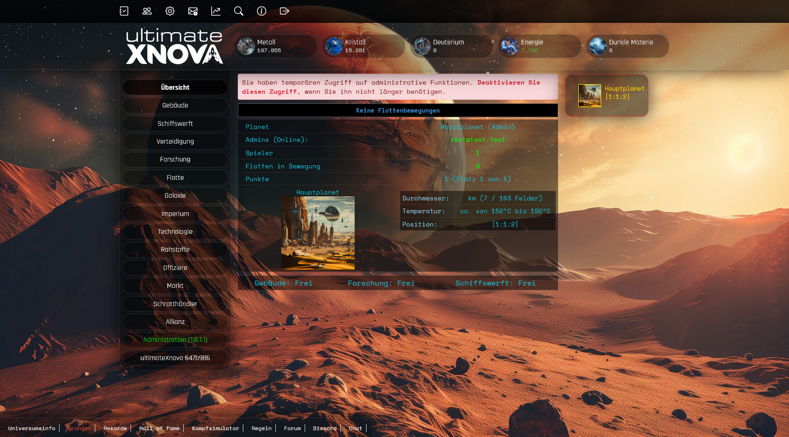
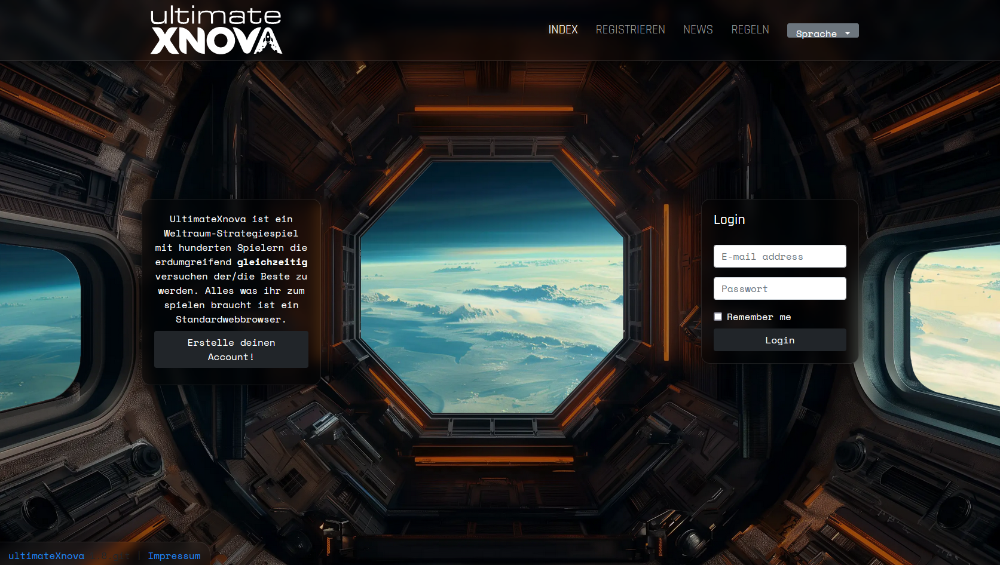
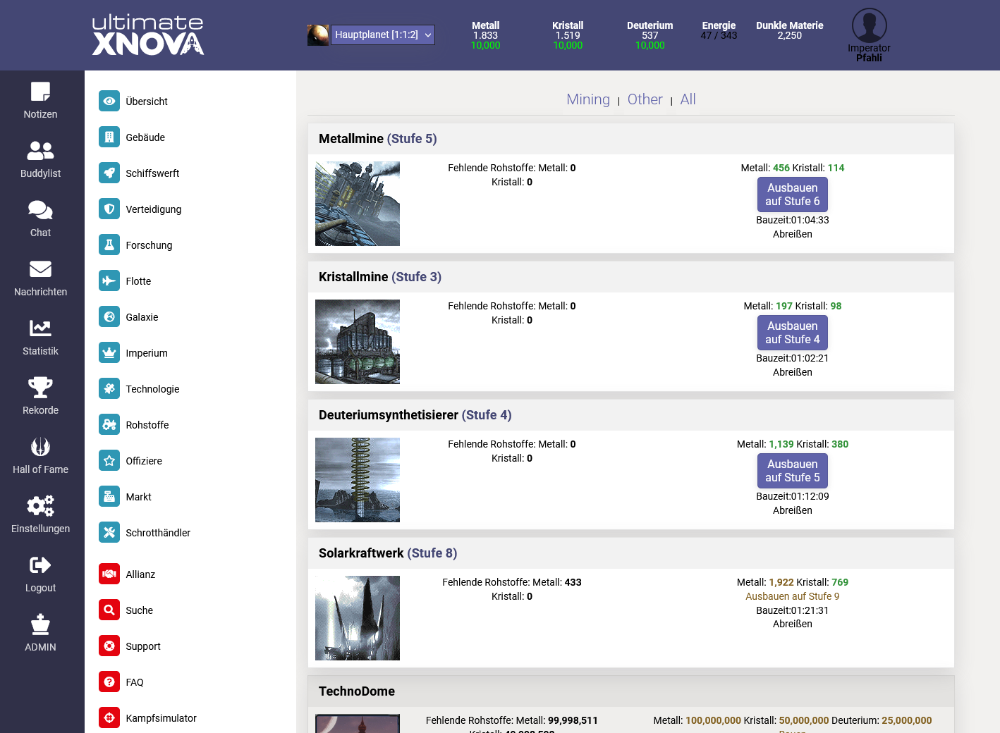
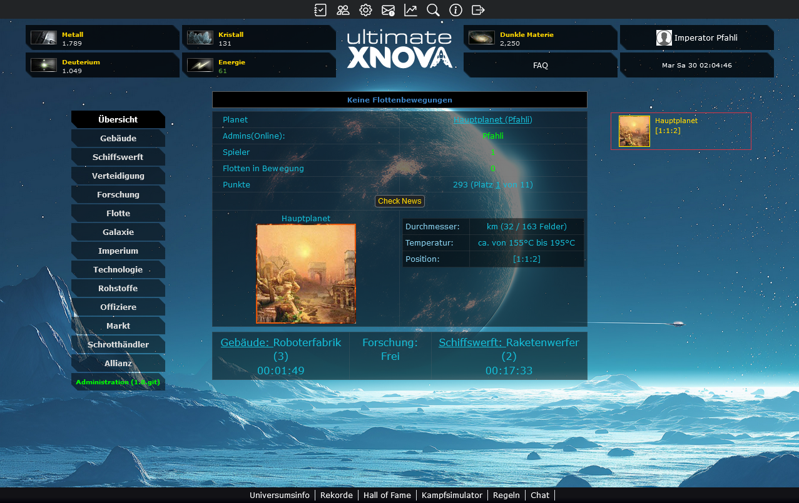
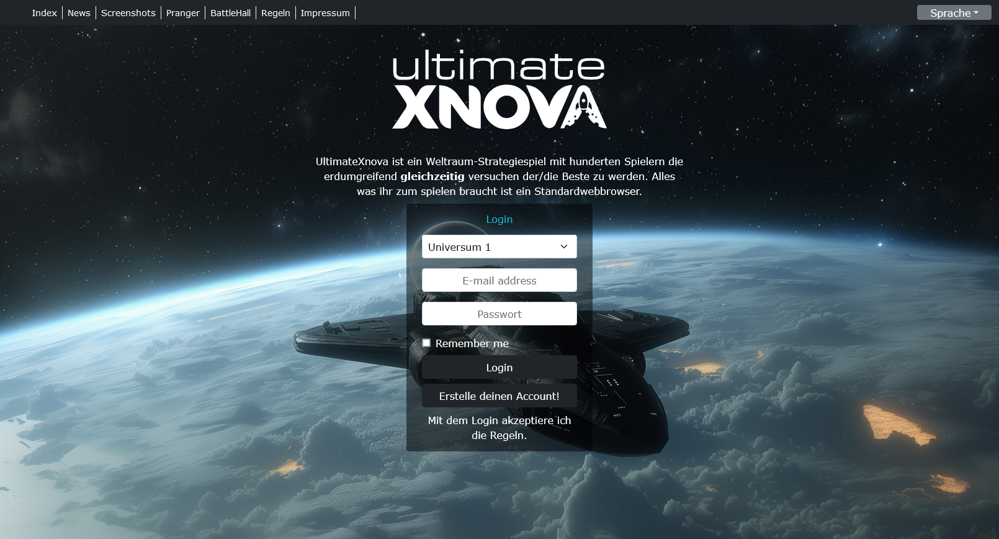

# Welcome to ultimateXnova

ultimateXnova is an open-source browser-based space exploration and conquest game. It provides a platform for players to build and manage their own interstellar empires, engage in diplomacy and warfare with other players, and explore the vastness of space.

## How to play

You can either play on an existing server or you can host your own server.

Official server: [game.ultimatexnova.de](https://game.ultimatexnova.de)

*If you want your server added here, feel free to open a new discussion [here](https://github.com/ultimatexnova/ultimatexnova/discussions)*

## How to install your own server

### Custom webserver
To install ultimateXnova, copy all the files onto you webserver via FTP.
Afterwards you can open https://*yourserver.tld*/install and follow the install wizard step by step. After you are finished, make sure to remove the file "ENABLE_INSTALL_TOOL" from the "/includes/" folder via FTP.

#### Requirements
* PHP 8.0, 8.1, 8.2 or 8.3
* MySQL Database
* SMTP credentials for sending of e-mails (optional)

### Docker
If you have docker installed, you can run ultimateXnova by opening the docker-compose.yml in the root folder of this repository. Make sure to change the MySQL user, root-password and password if you running it in a public environment.

The default port is set to 3838. To access the installer, just open http://localhost:3838. After you are finished, make sure to remove the file "ENABLE_INSTALL_TOOL" from the "/includes/" folder.

## UI-Updates

###  NextGen UI

We are currently working on a sleek and modern design to completely modernize the look and feel of the game by adding animations and haptics.
 

One of the target goals is to get rid of the tables and rewrite the templates with better class names and UIkit. This will also simplify mobile optimizations in the future.

#### Current progress
* New login screen
* New top navigation
* New resource panel
* New main navigation
* User-selectable background image

#### Work in progress
* Mobile optimisation
* New planet panel

#### Todo (Usable, but currently fallback to GOW theme)
* New dashboard
* New buildings, hangar, defense and research panels
* New galaxy view

<i>To enable the new login theme, set your default theme to NextGen in the admin center.</i>

### Brand new "Office"-Theme

Introducing a brand new design called "Office". This design is based on Teams to blend more fluidly into an office environment. By reducing visual clutter to a minimum and using a similiar styling, it is easier to play in public without other people noticing. It is still a work in progress as it is based on the old "Nova" theme which doesn't fully support all dependencies in buildings etc.
 

### Update of the "Galaxy of Wars"-Theme

The "Galaxy of Wars" theme has been updated with a new background and some small UI changes to make it more modern and simple. In the future, this theme will be further improved, as it is has the most functionality.
 
### New login screen

The login screen has also received a minor makeover by adding the logo to the top by default and changing the background.

## Roadmap

### Top priority

* Adding more responsive optimizations for mobile devices to the login and the themes
* More UI improvements
* Fixing major bugs
* New version numbering

### Medium priority

* Adding new configuration settings to the administration panel
* Adding option to upload custom logos for administrators
* Adding optional 2-Factor-Authentification for users
* Adding more login options with third party services

### Low priority

* Adding support for predefined custom color schemes for users in the settings
* Adding new isometric, sprite based visual representations of buildings and the hangar
* Adding new pictures for planets, buildings, fleet etc.
* Discord-Bot

## Contributions

This game is based on SteemNova 1.8-x.

For more information about SteemNova 1.8, you can visit the official repository on GitHub: [SteemNova 1.8 Repository](https://github.com/koraykarakus/steemnova-1.8-x)

